  

---

  

---
### 👀 Profile Views

---
<h2 align="center"><code>ABOUT_ME</code></h2>

- B.Tech in Electronics & Communication Engineering  NSUT'28
- Focused on Machine Learning, Deep Learning, Embedded Systems & Edge AI
- Building production-ready AI applications and intelligent systems
- Exploring LLMs, AI Infrastructure and Real-world ML deployment

---

<h2 align="center"><code>CORE_TECHNOLOGIES</code></h2>

<table width="900">

<tr>

<td align="center" width="50%">

<b>Languages</b>

  

</td>

<td align="center" width="420">

<b>Machine Learning</b>

  

</td>

</tr>

<tr>

<td align="center">

<b>Deep Learning</b>

  

</td>

<td align="center">

<b>LLM / Generative AI</b>

  

</td>

</tr>

<tr>

<td colspan="2" align="center">

<b>Deployment & Engineering</b>

  

</td>

</tr>

</table>

---

<h2 align="center"><code>FEATURED_PROJECTS</code></h2>

<i>Building production-ready AI & Embedded Systems projects.</i>  
Project showcase will be updated soon.

---

<h2 align="center"><code>GITHUB_ANALYTICS</code></h2>

---

  

---

<h2 align="center"><code>GITHUB_ACHIEVEMENTS</code></h2>

---

<h2 align="center"><code>🐍CONTRIBUTION_SNAKE</code></h2>

  

